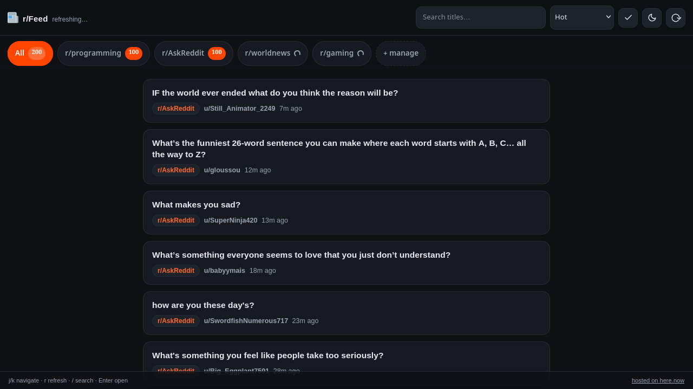

# r/Feed — subreddit RSS reader

Clean client-side subreddit feed reader. Live at **https://jovial-cosmos-amj3.here.now/**.

No build step, no dependencies: `index.html` + `style.css` + `app.js`.



## Feed architecture (cache-first)

```
browser (r/Feed)
  └─ 1. /cache/rss/{sub}-{sort}   → here.now proxy route → rss-cache.snakepit.us
        (caddy header gate) → rss-cacher container (fetches Reddit every 15m ± 4m
        jitter from the home IP; serves last good copy; 503 if never fetched)
  ├─ 2. /rss/{sub}/{sort}/.rss    → here.now proxy → www.reddit.com  (fallback)
  └─ 3. /old-rss/…                → here.now proxy → old.reddit.com (last resort)
```

- `.herenow/proxy.json` defines all three routes (the repo version is a
  template: `/cache/*` points at a placeholder upstream). The author's real
  upstream lives in `.herenow/proxy.local.json` (gitignored); `deploy.py`
  publishes the local override when present. The `/cache/*` route injects
  `X-Cache-Token` from the here.now account variable `RSS_CACHE_TOKEN`,
  so each deployment uses its own account's variable.
- **Nobody else's deployment touches the author's cache.** The app only
  fetches same-origin relative paths, and the author's cache host rejects
  every request without the token his here.now account holds. To use your
  own cache: run rss-cacher yourself (see below), create an
  `RSS_CACHE_TOKEN` variable on your here.now account, and point the
  `/cache/*` upstream at your host in a `proxy.local.json`.
- Feed naming convention: `{sub-lowercase}-{sort}` where sort ∈
  hot, new, rising, top, top-week, top-month, top-year, controversial.
  (rss-cacher names must match `^[a-z0-9]([a-z0-9-]*[a-z0-9])?$`.)
- Unknown feeds 404 → app falls back to the direct proxy routes, so subs
  added in the UI work even before they're registered in the cacher.

## Home-side services

| Service | systemd unit | Notes |
|---|---|---|
| rss-cacher (podman, ghcr.io/cksidharthan/rss-cacher) | `container-rss-cacher.service` | port 127.0.0.1:8082, data volume `rss-cacher-data`, FETCH_INTERVAL=15m, FETCH_JITTER=4m |
| caddy header gate | `rss-cache-caddy.service` | 127.0.0.1:8470, config `~/rss-cache/Caddyfile`, token in `~/rss-cache/cache-token.env` |
| cloudflared | `cloudflared-rss-cache.service` | tunnel `rss-cache` → rss-cache.snakepit.us |

- Feed registration: `python3 setup-cacher.py` (idempotent; creds in `cacher.env`).
  Add a sub by appending to `SUBS` in the script and re-running.
- Caddy rejects everything except `/healthz` and token-gated `/rss/*` —
  the admin API is never exposed publicly (manage it via localhost:8082).

## App features

Search (`/`), read/unread tracking with per-tab unread badges + mark-all-read,
keyboard nav (`j`/`k`/`Enter`/`r`/`/`/`Esc`), progressive "show more"
(fetches limit=100), 8 sort variants, dark/light theme, config share via
`#rf=<base64url>` fragment (auto-imports on load or hashchange),
dedupe by post ID, stale-cache fallback, two-pass retry with backoff on 429.
State lives in localStorage (`rf.*` keys).

## Deploy

```bash
python3 deploy.py                  # update prod slug
python3 deploy.py --create         # scratch site for testing
python3 deploy.py --slug <s> --delete
```

`deploy.py` publishes index.html, style.css, app.js **and the proxy
manifest** (omit it and the routes vanish). It uses
`.herenow/proxy.local.json` when present, otherwise the repo template.
Incremental deploys skip unchanged files via SHA-256 hashes.
Bump the `?v=N` query on `app.js`/`style.css` in index.html on every
JS/CSS change — browsers cache them aggressively.

## Pitfalls

- Reddit 429s bursts: the residential IP gets ~10-min penalties if hammered
  (registration bursts included). Keep per-feed fetches spread; the cacher
  retries with backoff each cycle and the app falls back gracefully.
- rss-cacher username must be an email; registration is open — never expose
  the admin API publicly (caddy blocks everything but the gated paths).
- here.now proxy routes: same-origin only, query params forwarded,
  browser headers stripped (inject User-Agent via the manifest).

## Credits

Feed caching is powered by [**rss-cacher**](https://github.com/cksidharthan/rss-cacher)
by [Siddharthan CK](https://github.com/cksidharthan) and contributors (MIT License).
r/Feed runs it as an unmodified container; without it the cache-first layer
would not exist. Thanks for a clean, well-documented tool.

## License

MIT — see [LICENSE](LICENSE).
